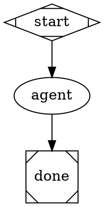

# Coding Agent Pipeline Handler

**Package**: `internal/attractor/handler` (in `coding_agent.go`)

Bridges the agent loop with the pipeline engine. A pipeline node with `type="coding_agent"` runs a full autonomous agent session as a single pipeline stage.

## Handler

`CodingAgentHandler` implements the `Handler` interface. It reads the node's `prompt` attribute and runs an agent session, storing the final response in the pipeline context.



### Attributes

| Attribute | Default | Description |
|---|---|---|
| `prompt` | (required) | Task description passed to the agent |
| `model` | `claude-sonnet-4-20250514` | LLM model identifier |
| `provider` | `anthropic` | Provider profile (`anthropic`, `openai`, `gemini`) |
| `max_rounds` | `200` | Maximum LLM round-trips |

### Context Updates

On success, stores `{node_id}.response` with the agent's final text output — same convention as `CodergenHandler`.

### Failure Modes

- Missing `prompt` attribute → `FAIL` with `FailureDeterministic`
- Agent session error → `FAIL` with `FailureTransient`
- Agent aborted (timeout/max rounds) → `FAIL` with `FailureTransient`
- No session factory configured → stub mode (returns placeholder response)

## Session Factory

The handler uses an `AgentSessionFactory` to create sessions, allowing the pipeline to inject custom LLM clients and configurations:

```go
type AgentSessionFactory func(node *model.Node, pctx *runtime.Context, g *model.Graph) *agent.Session
```

### Default Factory

`DefaultAgentSessionFactory` reads configuration from node attributes and pipeline context:

```go
factory := handler.DefaultAgentSessionFactory(llmClient, execEnv)
```

It passes the pipeline's `goal` context value as a user prompt to the agent session.

## Registration

The handler is registered as `type="coding_agent"` in the default registry:

```go
registry := handler.DefaultRegistry(
    handler.WithAgentSessionFactory(factory),
)
```

Or via `EngineConfig`:

```go
attractor.RunPipeline(ctx, dotSource, attractor.EngineConfig{
    AgentSessionFactory: handler.DefaultAgentSessionFactory(client, env),
})
```

## LLM Codergen Backend

**File**: `codergen_llm.go`

`LLMCodergenBackend` reimplements `CodergenBackend` as a thin wrapper around `llm.Client.Complete()`. This lets existing `type="codergen"` nodes use the same unified client infrastructure:

```go
backend := handler.NewLLMCodergenBackend(client, "claude-sonnet-4-20250514")
attractor.RunPipeline(ctx, dotSource, attractor.EngineConfig{
    CodergenBackend: backend,
})
```

The wrapper sends the prompt as a single user message and returns the response text. It respects `model` and `provider` keys in the options map if present.
