# Fidelity

**Package**: `internal/attractor/fidelity`

Fidelity modes control how much reasoning effort an LLM backend should apply. Lower fidelity = faster/cheaper, higher fidelity = more thorough.

## Modes

| Mode | Intended behavior |
|---|---|
| `full` | Maximum reasoning effort |
| `compact` | Balanced (default) |
| `summary:high` | Summarized output, high detail |
| `summary:medium` | Summarized output, medium detail |
| `summary:low` | Summarized output, low detail |
| `truncate` | Minimal output |

## Resolution Chain

Fidelity is resolved with a 4-step priority cascade:

```
edge attribute → node attribute → graph attribute → default (compact)
```

```go
mode := fidelity.Resolve(edge, node, graph)
```

Any level can be `nil` (skipped). The first valid fidelity value found wins.

### Example

```dot
digraph pipeline {
    graph [fidelity="compact"]                              // graph default
    A [shape=box, fidelity="full"]                          // node override
    B [shape=box]                                           // inherits graph default
    A -> B [fidelity="truncate"]                            // edge override (for this transition only)
}
```



- Node A: `full` (node-level)
- Node B via edge from A: `truncate` (edge-level)
- Node B via any other edge: `compact` (graph-level)

## Validation

The `fidelity_valid` lint rule checks that any `fidelity` attribute on nodes, edges, or the graph is a recognized mode. Invalid values produce a warning during pipeline validation.

## Preamble Generation

Before each handler execution, the engine generates a context preamble based on the resolved fidelity mode and stores it in the `internal.preamble` context key. Handlers can read this key to include appropriate context carryover in their LLM prompts.

```go
preamble := fidelity.GeneratePreamble(mode, runID, goal, visitLog)
```

| Mode | Preamble content |
|---|---|
| `truncate` | Run ID + goal only |
| `compact` | Run ID + goal + bullet-point summary of completed stages with outcomes |
| `summary:low` | Proportional detail (~600 token budget) |
| `summary:medium` | Proportional detail (~1500 token budget) |
| `summary:high` | Proportional detail (~3000 token budget) |
| `full` | Empty (no preamble — full session context assumed) |

Summary modes approximate token budgets at ~4 characters per token and truncate stage history to fit.

## Integration

The engine checks if a handler implements `FidelityAwareHandler`. If so, it calls `SetFidelity(mode)` before `Execute()`. The engine also generates a fidelity-appropriate preamble and sets it as the `internal.preamble` context key before handler execution.
