# Stylesheet

**Package**: `internal/attractor/style`

A CSS-like system for configuring per-node LLM parameters (model, reasoning effort, provider) via selectors with specificity-based resolution.

## Syntax

```css
* {
    llm_model: gpt-4;
    reasoning_effort: medium;
}

.box {
    llm_model: claude-3;
}

#critical_step {
    reasoning_effort: high;
}
```

Rules are `selector { property: value; }` blocks. Properties are arbitrary key-value pairs — the stylesheet doesn't validate them.

## Selectors

| Syntax | Matches | Specificity |
|---|---|---|
| `*` | All nodes | 0 (lowest) |
| `.box` or `box` | Nodes with `shape="box"` or `class` containing `"box"` | 1 |
| `#myNode` | Node with `ID="myNode"` | 2 (highest) |

A bare identifier (no prefix) is treated as a class selector. Class selectors match against both the `shape` attribute and the `class` attribute. The `class` attribute is parsed as a comma-separated list, so `class="agent, worker"` matches both `.agent` and `.worker`.

## Resolution

`Stylesheet.Resolve(node)` returns the merged property map for a node. Rules are applied in specificity order (lowest first), so higher-specificity rules overwrite lower ones. Within the same specificity, later rules win.

```go
ss, err := style.ParseStylesheet(src)
if err != nil {
    // structural error: unclosed brace, empty selector, etc.
}
props := ss.Resolve(node)
// props["llm_model"] → "claude-3" (from .box, overrides * rule)
// props["reasoning_effort"] → "high" (from #critical_step, overrides * rule)
```

## Application

The engine applies the stylesheet automatically between the parse and validate phases. If the graph has a `model_stylesheet` attribute, the engine parses it and calls `ss.Apply(g)`:

```go
// Apply sets stylesheet-resolved properties on nodes that don't already have
// an explicit value. Explicit node attributes always take priority.
ss.Apply(g)
```

This means you can set defaults in the stylesheet while still overriding them per-node:

```dot
digraph pipeline {
    model_stylesheet="* { llm_model: gpt-4; }\n.box { temperature: 0.5; }"
    A [shape=box]                          // gets llm_model=gpt-4, temperature=0.5
    B [shape=box, llm_model="claude-3"]    // keeps claude-3, gets temperature=0.5
}
```



## Validation

`ParseStylesheet` returns an error for structural problems (unclosed braces, empty selectors). The `stylesheet_syntax` validation rule checks this during pipeline validation.

## Integration Test Coverage

The `full_features.dot` fixture exercises all three selector types in a single stylesheet:

```css
* { llm_model: gpt-4; temperature: 0.7; }     /* wildcard */
.box { max_tokens: 4096; }                      /* shape/class */
#reviewer { fidelity: truncate; temperature: 0.2; }  /* ID */
```

`TestFullFeaturesPipeline/stylesheet_attrs` verifies:
- `worker_alpha` gets `llm_model=gpt-4` from the `*` rule
- `worker_gamma` keeps explicit `llm_model=claude-3` (not overridden by stylesheet)
- `reviewer` gets `temperature=0.2` and `fidelity=truncate` from the `#reviewer` rule
